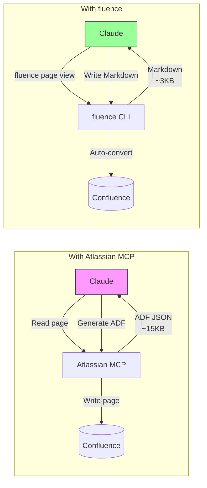
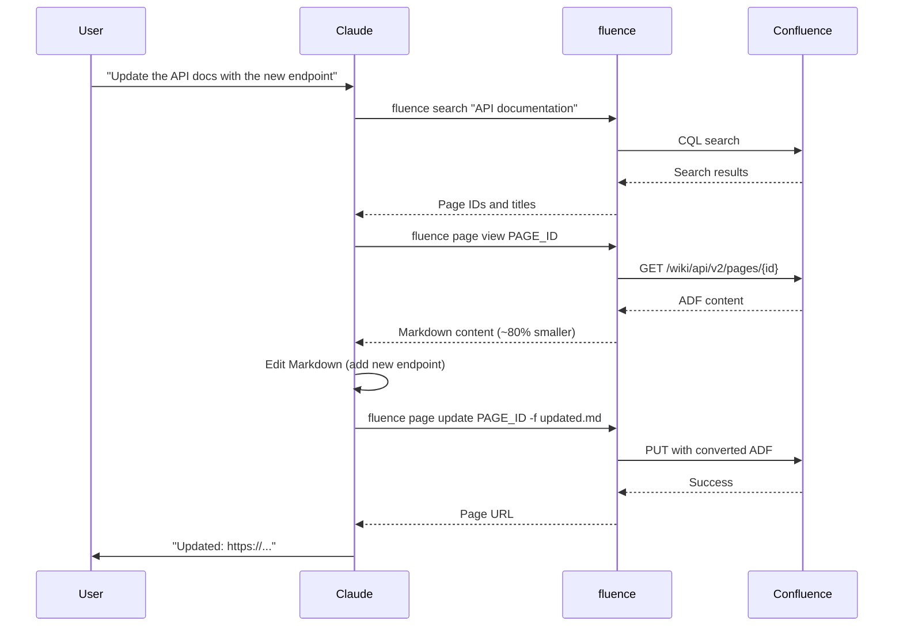

# fluence

A CLI tool for managing Confluence pages with bidirectional Markdown conversion. Write documentation in Markdown, publish to Confluence seamlessly.

## Why fluence?



### Token Efficiency

| Operation | Atlassian MCP | fluence | Savings |
|-----------|---------------|---------|---------|
| Read page | ~15KB ADF JSON | ~3KB Markdown | **~80%** |
| Write page | Complex ADF generation | Native Markdown | **~70%** |
| Round-trip | ~30KB total | ~6KB total | **~80%** |

**Why the difference?**

- **Atlassian MCP** returns Atlassian Document Format (ADF) - deeply nested JSON with metadata, marks, and attributes
- **fluence** converts to clean Markdown - the format Claude naturally reads and writes

This means faster responses, lower costs, and Claude can focus on content rather than wrestling with JSON structures.

## Installation

### From GitHub Releases (Recommended)

Download the latest binary for your platform from [Releases](https://github.com/fvoon/fluence/releases):

```bash
# macOS (Apple Silicon)
curl -L https://github.com/fvoon/fluence/releases/latest/download/fluence-darwin-arm64 -o fluence
chmod +x fluence
sudo mv fluence /usr/local/bin/

# macOS (Intel)
curl -L https://github.com/fvoon/fluence/releases/latest/download/fluence-darwin-amd64 -o fluence
chmod +x fluence
sudo mv fluence /usr/local/bin/

# Linux (x64)
curl -L https://github.com/fvoon/fluence/releases/latest/download/fluence-linux-amd64 -o fluence
chmod +x fluence
sudo mv fluence /usr/local/bin/

# Linux (ARM64)
curl -L https://github.com/fvoon/fluence/releases/latest/download/fluence-linux-arm64 -o fluence
chmod +x fluence
sudo mv fluence /usr/local/bin/
```

### From Source

Requires Go 1.21+:

```bash
git clone https://github.com/fvoon/fluence.git
cd fluence
go build -o fluence ./cmd/fluence
sudo mv fluence /usr/local/bin/
```

Or install directly:

```bash
go install github.com/fvoon/fluence/cmd/fluence@latest
```

## Configuration

Set environment variables for your Confluence instance:

```bash
export CONFLUENCE_BASE_URL="https://your-instance.atlassian.net"
export CONFLUENCE_EMAIL="your-email@example.com"
export CONFLUENCE_API_TOKEN="your-api-token"
export CONFLUENCE_SPACE_KEY="MYSPACE"  # optional default space
```

Get an API token from: https://id.atlassian.com/manage-profile/security/api-tokens

Add these to your `~/.zshrc` or `~/.bashrc` for persistence.

## Usage

### View a Page

```bash
# Output as Markdown
fluence page view PAGE_ID

# Output as JSON
fluence page view PAGE_ID -j
```

Extract PAGE_ID from Confluence URLs: `https://....atlassian.net/wiki/spaces/SPACE/pages/PAGE_ID/...`

### Create a Page

```bash
# From stdin
echo "# My Page\n\nContent here" | fluence page create -t "Page Title" -s SPACE

# From file
fluence page create -t "Page Title" -f content.md -s SPACE

# With parent page
fluence page create -t "Child Page" -f content.md -s SPACE -p PARENT_ID
```

### Update a Page

```bash
# From file with version message
fluence page update PAGE_ID -f content.md -m "Updated installation steps"

# Change title too
fluence page update PAGE_ID -f content.md -t "New Title"
```

### Search

```bash
# Full-text search
fluence search "deployment guide"

# Filter by space
fluence search "API docs" -s MYSPACE

# Search by title or label
fluence search --title "Migration"
fluence search --label "architecture"

# Raw CQL query
fluence search --cql "type=page AND title~'API'"
```

### List Pages

```bash
# List pages in a space
fluence page list -s SPACE

# List children of a page
fluence page list -p PARENT_ID

# Sort by modified date, descending
fluence page list -s SPACE --sort modified --desc
```

### Other Commands

```bash
fluence page delete PAGE_ID           # Delete a page
fluence page move PAGE_ID -p NEW_PARENT  # Move to new parent
fluence space list                    # List all spaces
fluence space view SPACE_KEY          # View space details
```

## Claude Code Integration

fluence includes a Claude Code skill for seamless AI-assisted documentation workflows.

### Install the Skill

Copy the skill to your Claude Code skills directory:

```bash
# Global (all projects)
mkdir -p ~/.claude/skills
cp -r .claude/skills/fluence ~/.claude/skills/

# Or use project-local (already included in this repo)
```

### Using with Claude Code

Once installed, Claude will automatically use fluence when you ask it to work with Confluence:

```
> Document this API endpoint in Confluence

> Update the deployment guide on our wiki with the new steps

> Search Confluence for our authentication documentation

> Create a new page under the Architecture section documenting this service
```

Claude will:
1. Use `fluence search` to find existing pages
2. Use `fluence page view` to read current content
3. Write/update content in Markdown
4. Use `fluence page create/update` to publish

### Workflow Example



## Markdown Support

fluence supports CommonMark and GitHub Flavored Markdown:

| Feature | Supported |
|---------|-----------|
| Headings | ✅ |
| Paragraphs | ✅ |
| Bold, Italic, Strikethrough | ✅ |
| Links and Images | ✅ |
| Code blocks (with syntax highlighting) | ✅ |
| Tables (GFM) | ✅ |
| Ordered/Unordered lists | ✅ |
| Task lists (checkboxes) | ✅ |
| Blockquotes | ✅ |

## Development

```bash
# Run tests
go test ./...

# Build with version
go build -ldflags "-X main.version=v1.0.0" -o fluence ./cmd/fluence

# Format code
gofmt -w .
```
